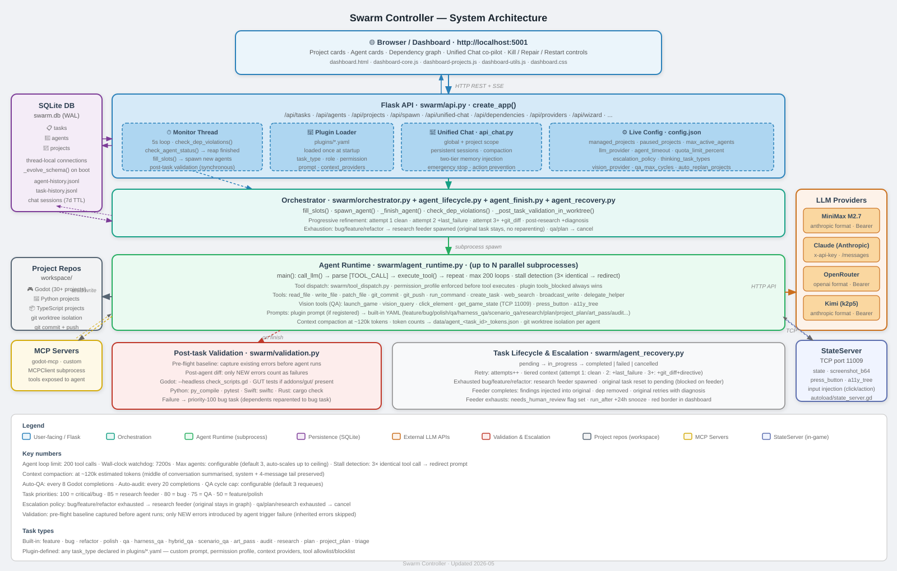

# Shrimphub

ShrimpHub is an open-source swarm orchestration system for agentic software development. It coordinates planning, implementation, QA, research, and meta-agents through task graphs, provider-backed LLM agents, runtime validation, and project memory. Learn more at [shrimphub.ai](https://shrimphub.ai).

Point it at a workspace full of projects, give it API keys, and it autonomously plans, implements, tests, and fixes — in parallel, across as many projects as you want. Supports Godot, Python, and TypeScript out of the box; extensible to any language via the plugin system.

> **Early software:** expect bugs, changing APIs, and hands-on log inspection. Primarily tested with MiniMax M3 — other providers (Claude, OpenRouter, Kimi) are supported but may be less stable.



## Features

- **Multi-provider LLM** — MiniMax, Claude (Anthropic), OpenRouter, Kimi, or any custom OpenAI-compatible or Anthropic-compatible endpoint
- **Parallel agents** — multiple agents per project with file-level locking; task planner generates proper DAGs, not just chains
- **Progressive refinement** — failed tasks retry with richer context each attempt (attempt 1: clean · attempt 2: +failure context · attempt 3+: +git diff + directive to try a different approach)
- **Research feeder escalation** — when retries are exhausted, a read-only research agent diagnoses the root cause and injects findings back into the original task; the original task stays in the dependency graph, nothing is reparented
- **Pre-flight baseline validation** — errors that existed before an agent ran are never counted as new failures; only regressions introduced by the agent trigger a bug task
- **Dependency graph** — full DAG with cycle detection, parallel execution levels, critical path analysis, and self-healing (chains unblock automatically when a dep is pruned)
- **Plugin system** — add new task types or override existing ones with a single YAML file; declare role, permission profile, prompt, tool allowlist/blocklist, and context providers (file, command, HTTP)
- **Unified Chat co-pilot** — conversational interface scoped to the full swarm or a single project; persistent sessions, two-tier memory, emergency stop, catastrophic action prevention
- **QA agents** — vision-capable agents that launch the game, read live state via TCP StateServer, interact via screenshot + click, and file bug tasks automatically
- **Harness QA** — deterministic checkpoint testing via `TestHarness` autoload; no vision model needed
- **Scenario QA** — compiled JSON scenario files that replay end-to-end user flows; near-zero cost after the first run
- **Art pass agents** — replace placeholder assets, wire up icons and sprites, screenshot-verify improvements
- **Auto-QA** — Godot projects automatically receive a QA task every 8 completions; audit every 20
- **Context compaction** — long agent conversations are summarised mid-run to stay within provider context windows
- **Stall detection** — if an agent repeats the same tool call 3× identically, a redirect prompt is injected automatically
- **Real-time dashboard** — live agent log streaming via SSE, dependency graph with minimap, per-project health metrics, token tracking
- **Project creation wizard** — chat-based scaffolding that plans a full task DAG and bootstraps a new git repo
- **SQLite state** — thread-safe WAL-mode storage; no JSON race conditions
- **MCP integration** — connect any MCP server (e.g. godot-mcp) for extended agent tooling

## Quick Start

```bash
curl -fsSL https://shrimphub.ai/install.sh | bash
```

The installer checks your Python version, clones the repo, sets up a virtual environment, prompts for your workspace path and API keys, detects Godot, and creates a `shrimphub` launcher command.

Then:

```bash
shrimphub start
```

Open **http://localhost:5001**

### Manual install

```bash
git clone https://github.com/shrimplabs/shrimphub.git
cd shrimphub
python3 -m venv .venv
source .venv/bin/activate          # Windows: .venv\Scripts\Activate.ps1
pip install -r requirements.txt

cp config.example.json config.json  # edit workspace path
# add API keys to .env
echo "MINIMAX_API_KEY=your_key" > .env

python swarm_runner.py api
```

## Prerequisites

- Python 3.11+
- At least one LLM API key (MiniMax, Anthropic, OpenRouter, or Kimi)
- Projects in a workspace directory (`workspace` in `config.json`)
- Godot 4.x binary (optional — only needed for Godot project agents and QA)

## Starting and Stopping (macOS)

Four scripts handle server lifecycle. Run them from the repo root.

| Script | What it does |
|--------|--------------|
| `./launch.sh` | Start swarm + VLM server, wait for the API to respond, open `http://localhost:5001` in your browser |
| `./shutdown.sh` | Stop both servers cleanly |
| `./start.sh` | Start swarm only (background, PID-tracked, logs to `data/swarm.log`) |
| `./stop.sh` | Stop swarm only |
| `./start-vlm.sh` | Start the local mlx-vlm vision server on port 8080 (waits up to 30s for ready) |
| `./stop-vlm.sh` | Stop the VLM server |

**Finder shortcuts:** `Swarm Launch.command` and `Swarm Shutdown.command` in the repo root are double-clickable macOS launcher files. Drop them in the Dock or on the Desktop. The first time you run them, macOS will ask for permission to open in Terminal.

**Logs:**
- Swarm: `data/swarm.log`
- VLM server: `data/vlm.log`
- Per-agent: `data/agent_<id>.log`

**The VLM server is only needed for QA agents** that use vision (screenshot analysis). If you're not running QA tasks, skip `start-vlm.sh`.

## Platform Support

- **macOS** — primary development platform; full feature set
- **Linux** — core flows work; GUI-oriented QA paths (screenshot capture) are less exercised
- **Windows** — core flows are being made platform-aware; end-to-end QA not fully validated yet

On Windows, set the Godot path explicitly in `config.json` using the `_console.exe` binary:

```json
{ "godot_path": "C:\\Program Files\\Godot\\Godot_v4.x-stable_win64_console.exe" }
```

## Configuration

`config.json` at the project root (gitignored). All fields are optional — `config.example.json` has the full list with comments.

```json
{
  "workspace": "~/path/to/your/projects",
  "managed_projects": ["project-a", "project-b"],
  "max_active_agents": 3,
  "llm_provider": "minimax"
}
```

| Key | Default | Description |
|-----|---------|-------------|
| `workspace` | `~/workspace` | Root directory containing your projects |
| `managed_projects` | `[]` | Project folder names to assign work to |
| `paused_projects` | `[]` | Projects that receive no work assignments |
| `max_active_agents` | `3` | Max concurrent agent subprocesses |
| `max_lines` | `5000` | Line count that triggers an auto-refactor task |
| `lock_project` | `false` | `true` = one agent per project at a time |
| `agent_timeout` | `7200` | Wall-clock seconds before a hung agent is killed (safety net — the 200-loop limit is the primary governor) |
| `quota_limit_percent` | `90` | Stop spawning when API quota exceeds this % |
| `llm_provider` | `"minimax"` | Active LLM provider |
| `task_selection_strategy` | `"least_recently_worked"` | How to pick the next task |
| `qa_max_cycles` | `3` | Max times a QA agent may requeue itself before writing a final report |
| `thinking_task_types` | `[]` | Task types that get extended thinking enabled (e.g. `["bug"]`) |
| `vision_provider` | `"minimax-mcp"` | Vision backend for QA agents |
| `login_required` | `false` | Enable session authentication |
| `meta_investigation` | `true` | Fire an out-of-band LLM investigator when the same error repeats 3+ times |
| `escalation_policy` | see below | Per-task-type retry and exhaustion behaviour |

Settings can be updated live via the API without restarting — changes persist to `config.json` automatically.

### Auto-discovery with `.swarmproject`

Any directory in your workspace that contains a `.swarmproject` file is automatically registered in the dashboard when the swarm starts — no `config.json` edits required.

```yaml
# .swarmproject
name: my-tool        # project name (defaults to directory name)
type: python         # python | godot | typescript
managed: false       # false = visible in dashboard, no agents assigned
                     # true  = agents may be assigned work automatically
```

Set `managed: false` (the default) for infrastructure projects like `shrimp-router` that you want visible but protected from accidental agent edits. Flip to `true` via the dashboard toggle or by editing the file when you're ready.

`shrimp-router` ships a `.swarmproject` file, so it appears in your dashboard automatically after `launch.sh` clones it — no manual registration needed.

### Escalation policy

Controls how the system handles tasks that exhaust their retry budget:

```json
{
  "escalation_policy": {
    "bug":     { "max_attempts": 3, "on_exhaust": "research", "research_max_attempts": 2 },
    "feature": { "max_attempts": 3, "on_exhaust": "research", "research_max_attempts": 2 },
    "qa":      { "max_attempts": 2, "on_exhaust": "cancel" }
  }
}
```

- `on_exhaust: "research"` — spawns a read-only research feeder that diagnoses the failure and injects findings back into the original task for another attempt. The original task stays in the dependency graph.
- `on_exhaust: "cancel"` — task is cancelled; no feeder spawned.

When a research feeder itself exhausts, the original task is flagged `needs_human_review`, snoozed for 24 hours, and shown with a red border in the dashboard.

## Security

> ⚠️ **The API has no authentication by default.** It is open to anyone on your network. For local-only use this is fine; if you expose the server beyond localhost, enable auth.

Add `"login_required": true` to `config.json`. Default credentials: `admin` / `admin`.

To set a strong password:

```bash
python - <<'PY'
from swarm.login import hash_password_for_storage
pw, salt = hash_password_for_storage(input("Password: "))
print(f'"login_password_hash": "{pw}",\n"login_salt": "{salt}"')
PY
```

Add the output plus `"login_required": true` and `"login_username": "admin"` to `config.json`.

## LLM Providers

| Provider | Format | Env var | Default model |
|----------|--------|---------|---------------|
| `minimax` | Anthropic-compatible Bearer | `MINIMAX_API_KEY` | `MiniMax-M3` |
| `claude` | Native Anthropic API | `ANTHROPIC_API_KEY` | `claude-sonnet-4-6` |
| `openrouter` | OpenAI chat completions | `OPENROUTER_API_KEY` | `anthropic/claude-3.5-sonnet` |
| `kimi` | Anthropic-compatible Bearer | `KIMI_API_KEY` | `k2p5` |

Override a model:

```json
{
  "llm_provider": "openrouter",
  "llm_providers": {
    "openrouter": { "model": "google/gemini-2.0-flash-exp" }
  }
}
```

Register a custom provider at runtime via `POST /api/provider`:

```json
{
  "provider": "my-local",
  "base_url": "http://localhost:11434/v1",
  "api_key_env": "OLLAMA_KEY",
  "format": "openai",
  "model": "llama3.2"
}
```

`format` is one of `anthropic`, `anthropic_native`, or `openai`.

## Task Types

| Type | Priority | Description |
|------|----------|-------------|
| `bug` | 80 | Find and fix bugs |
| `qa` | 75 | Vision-capable QA: launch game, screenshot, verify via StateServer |
| `harness_qa` | 75 | Deterministic checkpoint QA using `TestHarness` autoload |
| `hybrid_qa` | 75 | Combined vision + harness QA |
| `scenario_qa` | 75 | Replay compiled JSON scenario files end-to-end |
| `feature` | 50 | Implement new functionality |
| `refactor` | 50 | Reduce file size, improve structure |
| `polish` | 50 | UX and visual improvements |
| `art_pass` | 50 | Replace placeholder assets, improve visuals |
| `research` | 50 | Read-only investigation; produces findings injected into the task that requested it |
| `plan` | 50 | Read-only planner — write-blocked; creates tasks as its deliverable |
| `project_plan` | 50 | Godot sprint planner — reads `GAME_DESIGN.md`, creates a full dependency-ordered task DAG |
| `audit` | 50 | Code quality audit |
| `triage` | 50 | Issue triage — files bug tasks, writes `TRIAGE_REPORT.md` |

**Plugin-defined types** — any `task_type` declared in `plugins/*.yaml` is automatically available. See [Plugin System](#plugin-system).

### Creating tasks

Via the API:

```json
POST /api/tasks
{
  "project": "my-project",
  "type": "feature",
  "description": "Add a high score leaderboard",
  "priority": 50
}
```

Or in batch with dependency wiring:

```json
POST /api/tasks/batch
{
  "project": "my-project",
  "tasks": [
    { "type": "bug",     "description": "Fix collision detection",    "priority": 80 },
    { "type": "bug",     "description": "Fix score not saving",       "priority": 80 },
    { "type": "feature", "description": "Add leaderboard (needs both above)", "priority": 50, "depends_on": [0, 1] }
  ]
}
```

`depends_on` takes integer indices into the `tasks` array — resolved to real IDs before creation. Response includes `id_map` for follow-up calls.

## Plugin System

Add new task types or override built-in ones with a YAML file in `plugins/`:

```yaml
# plugins/lore_pass.yaml
plugin_id: "lore_pass"
task_type: "lore_pass"
display_name: "Lore Consistency Pass"
role: "implementation"          # implementation | qa | research | planning
permission_profile: "read_write" # full | read_write | read_only | qa_write

prompt_file: "plugins/lore_pass_prompt.yaml"

tools_blocked:
  - "run_command"

context_providers:
  - type: file
    path: "GAME_DESIGN.md"
    max_chars: 12000
  - type: command
    command: "git log --oneline -10"
    timeout_seconds: 5
    max_chars: 500
```

Permission profiles are enforced at the tool-dispatch layer — not just in the prompt. `tools_blocked` always wins. Restart the server to pick up new plugins.

See [docs/plugin_system.md](docs/plugin_system.md) for the full schema reference, all context provider types, and a worked example.

## Dashboard

Open **http://localhost:5001**

- **Project cards** — health score, task counts, last commit age, per-project controls
- **Agent cards** — live loop counter, token usage, context compaction meter, streaming log via SSE
- **Dependency graph** — interactive DAG with minimap; click any task to inspect or reset it
- **Unified Chat** — co-pilot scoped to the full swarm or a single project; persistent across sessions
- **needs_human_review** — tasks flagged after a research feeder exhausts appear with a red border
- **Repair** — surgically fixes broken project state (resets failed/orphaned tasks, resurrects missing deps)
- **Restart** — resets all tasks for a project to pending (nuclear option)
- **Auto mode** — continuously fills agent slots; pauses automatically when API quota is hit
- **Kill / Kill All** — stop individual agents or all at once with confirm dialog
- **New Project wizard** — conversational scaffolding that plans a full task graph and bootstraps a git repo

## CLI (`swarm-code`)

`tools/swarm-code.py` is a standalone terminal harness for the swarm API. No extra dependencies — stdlib only.

```bash
# Create a task and block until it finishes (streams agent log in real time)
python3 tools/swarm-code.py raccoon-city "add a leaderboard" --wait
python3 tools/swarm-code.py raccoon-city "fix the save bug" --type=bug --wait

# Fire and forget — create task, print task ID, exit
python3 tools/swarm-code.py raccoon-city "add analytics"

# Interactive chat REPL (global swarm scope or project-scoped)
python3 tools/swarm-code.py --chat
python3 tools/swarm-code.py --chat raccoon-city

# Scriptable — pipe input for non-interactive use
echo "how many agents are running?" | python3 tools/swarm-code.py --chat

# Tail a running agent's log
python3 tools/swarm-code.py --watch <agent_id>

# Health + active agents + pending task counts
python3 tools/swarm-code.py --status
```

**Options:**

| Flag | Description |
|------|-------------|
| `--type` | Task type: `feature`, `bug`, `refactor`, `polish`, `qa`, `research`, `plan` (default: `feature`) |
| `--priority` | Task priority integer (default: 80 for bug, 50 for everything else) |
| `--wait` | Block until the task completes; stream agent log while running |
| `--chat [project]` | Start interactive chat REPL; omit project for global swarm scope |
| `--watch <id>` | Stream a running agent's log by agent ID |
| `--status` | Print swarm health, active agents, and task counts |

**Config via environment:**

```bash
export SWARM_URL=http://my-server:5001   # default: http://localhost:5001
export SWARM_TOKEN=my-token             # only needed if login_required: true
```

**Scripting examples:**

```bash
# Block until done, then deploy
python3 tools/swarm-code.py raccoon-city "fix the save bug" --type=bug --wait && ./deploy.sh

# Query swarm state from a script
RUNNING=$(echo "how many agents running?" | python3 tools/swarm-code.py --chat)

# Create multiple tasks in a loop
for proj in raccoon-city iron-ember; do
  python3 tools/swarm-code.py "$proj" "run the weekly audit" --type=audit
done
```

## Architecture

```
swarm_runner.py              thin entry point + generate_task_script()
install.sh                   one-command installer
plugins/                     agent profile plugin YAMLs (user-defined)
prompts/                     Jinja2+YAML prompt templates per task type
templates/godot/             canonical Godot support files (state_server, test_harness, GUT)
swarm/
  api.py                     Flask app factory, all route modules, monitor thread
  orchestrator.py            scheduling, agent fill, quota, dep violation checks
  agent_lifecycle.py         agent spawning, status checking, history pruning
  agent_finish.py            completion pipeline: diff, validation, auto-tasks
  agent_recovery.py          escalation policy, research feeder, progressive refinement
  agent_runtime.py           LLM tool loop (200-loop limit), stall detection, compaction
  tool_dispatch.py           tool validation, permission enforcement, dispatch table
  plugins.py                 plugin loader, context providers, permission profiles
  validation.py              pre-flight baseline + post-agent diff validation
  db.py                      SQLite layer (WAL, thread-local, schema evolution)
  dependencies.py            DAG, cycle detection, critical path, subgraph BFS
  qa_tools.py                QA vision tools: StateServer client, click, screenshot
  api_chat.py                Unified Chat — sessions, memory, compaction, emergency stop
  integrity.py               real-time task authority validation, orphan detection
data/
  swarm.db                   SQLite database (tasks, projects, agents)
  agent-history.jsonl        archived completed agent records
  task-history.jsonl         archived completed/failed task records
  agent_<id>.log             per-agent execution log
  chat_sessions/             persistent chat session files (7-day TTL)
```

### Agent lifecycle

1. `orchestrator.fill_slots()` picks the next task (checks deps, paused/managed lists, locks, dep violations)
2. `generate_task_script()` builds a Python wrapper with embedded config, prompts, and plugin context
3. Wrapper launched as a subprocess; imports `swarm.agent_runtime` and sets config vars
4. `agent_runtime.main()` runs: call LLM → parse `[TOOL_CALL]` → `tool_dispatch.execute_tool()` → repeat (max 200 loops)
5. On completion: diff captured, post-task validation runs, auto-QA/audit tasks spawned if threshold reached
6. On failure: tiered retry context injected; on exhaustion: research feeder spawned per escalation policy
7. Finished agent records pruned to `data/agent-history.jsonl`

### Validation

Before an agent starts, `validation.capture_validation_baseline()` runs and records existing error signatures. After the agent finishes, only errors that are **new** (not in the baseline) count as failures. This prevents pre-existing environmental issues from cascading into false-positive bug tasks.

Supported project types: Godot (GDScript parse + scene load + GUT tests), Python (py_compile + pytest), TypeScript (tsc), Swift (swiftc), Rust (cargo check), C# (mcs).

## Godot QA Setup

QA agents need `StateServer` registered as a Godot autoload:

```
# project.godot
[autoload]
StateServer="res://autoload/state_server.gd"
```

Copy `state_server.gd` from `templates/godot/autoload/` — never write it from scratch.

Optionally implement `get_game_state() -> Dictionary` on your root scene for domain-specific state reads.

StateServer commands over TCP port 11009:

| Command | Response |
|---------|----------|
| `{"command":"state"}` | Full scene tree + game state |
| `{"command":"screenshot_b64"}` | `{"image_base64":"<png>"}` |
| `{"command":"input","type":"click","x":N,"y":N}` | Inject mouse click |
| `{"command":"press_button","id":"start"}` | Fire button by `qa_label` metadata or node name |
| `{"command":"a11y_tree"}` | Flat list of all visible interactive elements |

## MCP Integration

```json
{
  "mcp_servers": {
    "godot": {
      "command": "godot-mcp",
      "env": { "GODOT_PROJECT_PATH": "/path/to/project" }
    }
  }
}
```

Agent tools: `mcp_list_tools(server)`, `mcp_call_tool(server, tool_name, args)`.

## Testing

```bash
pip install -r requirements.txt -r requirements-dev.txt

pytest                                        # full suite (excludes dashboard)
pytest tests/test_api.py                      # API routes
pytest tests/test_lifecycle.py                # real subprocess spawn/complete/kill
pytest tests/test_fill_slots.py               # scheduling logic
pytest tests/test_agent_runtime.py            # LLM loop + tools
pytest tests/test_improvements.py             # robustness + escalation

# Dashboard tests (requires one-time Playwright install):
playwright install chromium
pytest tests/test_dashboard.py
```

## Architecture Notes

- [Plugin System](docs/plugin_system.md) — full schema reference, context providers, worked example
- [Controller Integrity Model](docs/controller_integrity_model.md) — invariants, branch continuity, state ownership
- [Controller Integrity Health Model](docs/controller_integrity_health_model.md) — reading diagnostics, dashboard signals, repair actions
- [Controller Module Boundaries](docs/controller_module_boundaries.md) — canonical homes for each concern
- [Controller Delegation Model](docs/controller_delegation_model.md) — helper delegation, child-task delegation, file-scope safety
- [Legacy Project Migration Guide](docs/legacy_project_migration_guide.md) — normalising older projects
- [RAG Integration](docs/rag.md) — optional vector search for agent code context

## License

See [docs/licenses.md](docs/licenses.md).
