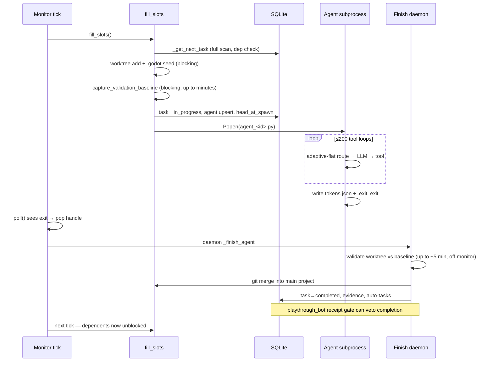

# Systems Diagram — How the Swarm Controller Actually Works Today

*Fable deep review, 2026-07-13. Based on reading the code as of commit `a719d14f`, not CLAUDE.md.*

## Corrections to the documented mental model (read this first)

Two load-bearing claims in CLAUDE.md are **stale**:

1. **"Post-task validation runs synchronously in the monitor thread"** — no longer true.
   `check_agent_status()` (agent_lifecycle.py:480) pops finished agents from
   `_active_handles` and runs `_finish_agent()` **in a daemon thread per agent**. The
   `_finishing_agents` set + `get_active_count()` keep the slot occupied until the finish
   thread completes, so fill_slots doesn't over-spawn during validation.

2. **Where the monitor DOES still block**: validation moved to *spawn time*, not finish time.
   `fill_slots()` → `spawn_agent()` → `capture_validation_baseline()`
   (agent_lifecycle.py:305 → validation.py:115) runs the **full validation suite —
   including GUT tests with a hardcoded 300s inner timeout — synchronously inside the
   monitor thread**, once per spawned agent. The `timeout=60` argument passed by the
   baseline call is largely decorative; the inner subprocess steps carry their own
   hardcoded timeouts (120s parse check, 300s GUT, 120s scene checks...). Additional
   synchronous monitor-thread work: worktree creation + `.godot` copytree (can be
   hundreds of MB), `run_closure_verification()` on the expansion-blocked path
   (orchestrator.py:522), and `_run_idle_closure_verification_cycle()` when idle.

So the "monitor blocks up to 5 minutes" problem was **moved, not solved** — from
per-finish to per-spawn. With `spawn_per_cycle: 1` it is bounded at one baseline run
per tick, but a slow Godot import can still stall the tick for minutes.

## Top-level topology

```
                     ┌────────────────────────────────────────────────────────┐
                     │                 Flask app (create_app)                  │
                     │  swarm/api.py — port 5001                               │
                     │  registers ~20 api_*.py route modules                   │
                     │  ┌──────────────┐  ┌───────────────┐  ┌──────────────┐ │
                     │  │ _monitor()    │  │ _quota_watcher│  │ HTTP handlers│ │
                     │  │ daemon thread │  │ daemon thread │  │ (Flask pool) │ │
                     │  └──────┬───────┘  │ every 10s     │  └──────┬───────┘ │
                     └─────────┼──────────┴───────────────┴─────────┼─────────┘
                               │                                     │
              every 5s (30s idle)                        task CRUD, spawn, chat,
                               │                         deps, integrity, wizard
                               ▼                                     │
       ┌───────────────────────────────────────────┐                │
       │        orchestrator / agent_lifecycle      │◄───────────────┘
       │  check_ghost_merge_tasks                   │
       │  check_dep_violations   (kills violators)  │        ┌──────────────────┐
       │  check_agent_status ────► _finish_agent    │───────►│  SQLite (WAL)     │
       │        (daemon thread per finished agent)  │        │  data/swarm.db    │
       │  check_infra_freeze                        │        │  tasks/projects/  │
       │  sweeps: ghost deps, orphan Godot, logs    │        │  agents/signals   │
       │  fill_slots ──► _get_next_task ──► spawn   │        └──────────────────┘
       └───────────────┬───────────────────────────┘
                       │ subprocess.Popen(python data/agent_<id>.py)
                       ▼
       ┌───────────────────────────────────────────┐
       │  Agent subprocess (agent_runtime.main)     │  N ≈ 7–25 concurrent
       │  tool loop ≤200 iters, adaptive-flat       │
       │  routing via shrimp-router :8090           │
       │  works in git worktree .wt-<proj>-<agent>  │
       │  writes: agent_<task>_tokens.json,         │
       │          rl_events.jsonl, log file         │
       └───────────────────────────────────────────┘
```

Three long-lived threads plus per-event daemon threads:

| Thread | Cadence | Job |
|---|---|---|
| `_monitor` | 5s active / 30s idle | reap agents, kill dep violators, sweeps, fill_slots |
| `_quota_watcher` | 10s, independent | quota suspension flag + SIGUSR signals to agents (deliberately decoupled so monitor stalls don't delay quota stops) |
| `_finish_agent` daemons | per agent exit | validation diff, merge, task completion, auto-tasks |
| periodic daemons | hourly | worktree cleanup, log rotation |

## The monitor tick (swarm/api.py:592)

```
sleep(5 if active|auto|suspended else 30)
_last_monitor_tick = now                       # health endpoint reads this
prefetch: completed_ids, all_task_ids          # scoped to managed_projects
│
├─ check_ghost_merge_tasks()                   # worktree.py — stale bug-merge-*
├─ check_dep_violations(prefetched)            # kills agents w/ unmet deps
│    checks BOTH _active_handles (in-memory)
│    and db.agent_get_active() (restart survivors)
├─ check_agent_status()                        # reap: poll() each handle
│    finished → _finishing_agents.add → pop handle → daemon _finish_agent
│    timed out → kill → daemon _finish_agent
│    then reconcile_agent_runtime_state(), prune_history()
├─ check_infra_freeze(db, config)
├─ every 20 ticks:  _sweep_ghost_deps          # prune dep edges → deleted IDs
├─ every 10 ticks:  _sweep_orphaned_godot      # lsof :11009-11209, kill non-children
├─ every 720 ticks: cleanup_orphaned_worktrees # daemon thread
├─ hourly:          log rotation               # daemon thread
├─ rate-limit pressure: rate_limited_*.flag files + rl_events.jsonl scan
│    → 5-min spawn cooldown (unless AUTO_SCALE, which steps MAX_ACTIVE_AGENTS instead)
├─ auto_scale_step(recent_429s)                # ±1 agent, 60s/120s cooldowns
├─ if suspended_for_quota: continue
└─ if auto_mode: fill_slots(generate_task_script)
     └─ daily audit_learnings task upsert
```

## fill_slots (orchestrator.py:391) — the scheduling decision

```
_check_llm_connectivity()          # TCP connect to provider, 5s timeout — IN MONITOR THREAD
with _fill_slots_lock:             # serializes concurrent fill_slots (API spawn vs monitor)
  sprint cycle for AUTO_REPLAN_PROJECTS:
     queue empty → upsert sprint QA task (first) or project_plan (after QA)
  loop (≤ SPAWN_PER_CYCLE, default 1):
     get_active_count() >= MAX_ACTIVE_AGENTS? → break
     task = _get_next_task(exclude=_tried)
     closure gate: if task is expansion-blocked & no repair alternative
        → run_closure_verification(project)      # SYNCHRONOUS, monitor thread
     spawn_agent(task, generate_task_script)
  meta agents (librarian / gardener / auditor / archaeologist / scheduler)
     — only when idle and under quota
```

### _get_next_task (orchestrator.py:870) — full-table filter chain

Every call: `backfill_completed_task_ids()` → `task_get_all(projects=managed)` →
filter pending by, in order:

1. not `phase_gate`, `can_task_accept_agent` (malformed row guard)
2. project not paused; not swarm-controller unless `allow_self_modification`
3. project `managed` flag; vision-QA concurrency cap (2)
4. `run_after` in the past; project not locked
5. inherited worktree not occupied by an active agent
6. all deps met — dep is met iff `completed` OR **absent from tasks table entirely**
   (dependencies.py:12, the "escape hatch" that makes ghost-dep sweeps load-bearing)

Then `_sort_by_strategy` (closure-policy rank, conflict-first, complexity-adjusted
priority) and the closure expansion gate: frozen/stalled projects with open regressions
push feature/polish/refactor behind repair tasks; if *everything* is blocked, the top
task passes anyway (anti-deadlock rule).

## spawn_agent (agent_lifecycle.py:235) — synchronous, in monitor thread

```
duplicate guards: can_task_accept_agent + no active agent on same task_id
worktree: reuse from metadata (retry chains) or git worktree add + .godot copytree
capture_validation_baseline()      # FULL validation run — the big monitor blocker
head_at_spawn := git rev-parse HEAD → task.metadata   # evidence attribution anchor
write data/agent_<id>.py wrapper (generate_task_script bakes in config globals)
Popen → _active_handles[agent_id] = {process, task_id, worktree, log, started}
db.agent_upsert(active) ; db.task_update_status(in_progress, agent_id)
```

The wrapper script is a config snapshot: `swarm_runner.generate_task_script()` embeds
WORKSPACE, provider, pipeline, QA cycle, worktree path as module globals, then calls
`swarm.agent_runtime.main()`. Agents therefore run **frozen config** — a config change
mid-run doesn't touch running agents (except quota signals via the SIGUSR path).

## The agent tool loop (agent_runtime.py:418)

```
main():
  pipeline configured? → run_pipeline() (phase machine, pipeline.py) → exit
  else flat loop, ≤ MAX_TOOL_LOOPS (200):
     adaptive-flat routing (default ON, run-12 policy):
        choose_adaptive_flat_provider(model_routing.py:81)
          loop 0                        → strong  ("first_loop_sets_intent")
          last tools all read-only      → cheap   (M2.7), capped at 3 consecutive
          any strong tool / no signal   → strong  (M3)
          strong task types (bug, qa, art_pass, polish, research…) → strong
             except a single read-only probe loop
        cheap-tier TASK_COMPLETE is BLOCKED (cheap_completion_blocks) —
        only the strong model may declare completion
     jitter sleep 0.5–3s → call_llm → parse [TOOL_CALL] → execute_tool (tool_dispatch)
     stall detection (3 identical calls → redirect injection)
     context compaction at ~120k est. tokens
     wrap-up warning near loop limit → continuation task creation
  exit: write agent_<task_id>_tokens.json {tokens, cache, loop_count, provider, model}
        write .exit file with real exit code
```

## _finish_agent (agent_finish.py:981) — completion pipeline (daemon thread)

```
Phase 1  release file locks (crash safety net)
Phase 2  resolve exit code (.exit file wins) → read full log
         classify success: exit 0 OR standalone TASK_COMPLETE marker
         continuation spawned? → treat as successful handoff
         playthrough_bot? → require complete PLAYTHROUGH_RESULT receipt with
           agency_evidence, else flip success→False (the completion gate)
Phase 3  worktree phase (_finish_worktree_phase):
         success → validate IN WORKTREE → diff vs spawn-time baseline
                   only NEW error signatures fail; inherited ones logged, merge proceeds
                   → git merge --ff-only → merge --no-edit → rebase-retry
                   → conflict: bug-merge-* task chained onto existing merge-task tail
         failure → discard worktree
Phase 4  diff stat (success only), token file read, cost estimate,
         agent row → completed/failed (tokens, loops, provider, model, cost)
Phase 5a reparent continuation dependents (original → continuation id) — runs on
         success AND failure (failure path deadlock fix)
Phase 5b success: completion evidence (head_at_spawn..HEAD commit count; zero-commit
         write task → soft "unverified" flag) → _phase_complete_task:
           task→completed, task_record_completed, cancel stale feeders/recovery,
           plan record for project_plan, webhook, regression refresh
         research feeder? → _apply_research_feeder_result (inject findings, unblock original)
Phase 5c failure: worktree-validation failure → cross-check main:
           main clean  → stale worktree error → mark completed anyway
           main dirty  → _spawn_validation_bug_task (reparents dependents), original→completed
           else _handle_task_failure → tiered retry / research feeder escalation
Phase 6  release project lock, delete wrapper script, experiment metrics JSONL,
         signal extraction (agent_signals table)
Phase 7  post-completion (success only): plan validation (can flip success→failure),
         post-validation for non-worktree tasks, auto integration / sprint QA /
         auto-QA (every 8) / auto-audit (every 20) / auto playthrough task,
         learnings extraction (async), librarian counter
```

## DB layer (swarm/db.py)

- One SQLite file, `PRAGMA journal_mode=WAL`, `synchronous=NORMAL`, `foreign_keys=ON`.
- **Thread-local connections** (`_connect()`, db.py:181): every thread — monitor, each
  finish daemon, each Flask request, each sweep — gets its own connection lazily.
  Daemon finish threads leak one connection each until thread death (SQLite handles
  this; WAL allows N readers + 1 writer).
- `_task_write_lock` (single process-wide `threading.Lock`) serializes `task_upsert` /
  `task_update` / `task_update_status` — this, not SQLite, is the real write mutex.
  Reads are unserialized.
- Schema evolution via `ALTER TABLE` in `_evolve_schema()` at startup.
- Cycle prevention at write time: `_would_introduce_cycle()` DFS scoped to the task.
- Tasks are immutable history (never deleted); agents are pruned to
  `agent-history.jsonl` after finish by `prune_history()` **every monitor tick**.

## State that lives OUTSIDE the DB (the federation blockers)

| State | Where | Consequence |
|---|---|---|
| `_active_handles` | agent_lifecycle module dict | process handles; restart → orphan PIDs reconciled via DB agents table |
| `_finishing_agents` | module set | slot accounting during finish |
| `_qa_completion_counter`, `_projects_sprint_qa_done` | module dicts | auto-QA cadence resets on restart |
| auto-mode / suspension | `auto_mode_state` dict in create_app closure | dashboard toggle |
| rate-limit signals | `rl_events.jsonl`, `rate_limited_*.flag` files | agents→monitor IPC via filesystem |
| token/pipeline handoff | `agent_<task>_tokens.json`, `_pipeline.json` | agent→finish IPC via filesystem |
| config | `config.json` + module globals synced into `swarm_runner` | wrapper scripts freeze it |

## Sequence: one task, cradle to grave



## What is genuinely event-driven already vs. what polls

| Mechanism | Nature |
|---|---|
| Agent exit → finish | **poll** (5s `poll()` sweep) → then event-ish (daemon thread) |
| Task created → scheduled | **poll** (next fill_slots full scan) |
| Dep satisfied → dependent runs | **poll** (recomputed from scratch every `_get_next_task`) |
| Quota exceeded → agents stopped | **poll** (10s dedicated watcher) + signal push to agents |
| Rate limit → cooldown | **poll** (file flags read per tick) |
| Dashboard log stream | **event** (SSE tail) |
| Validation | synchronous inline: at spawn (monitor thread) and at finish (daemon thread) |

The system is a 5-second-heartbeat batch scheduler with per-exit daemon workers grafted
on. Every scheduling decision is recomputed from a full managed-projects table scan on
every tick — correct by construction (no cached state to go stale) and the reason the
system tolerates restarts so well, but O(tasks × ticks) and the root of the coupling
analysis in `02-coupling-analysis.md`.
